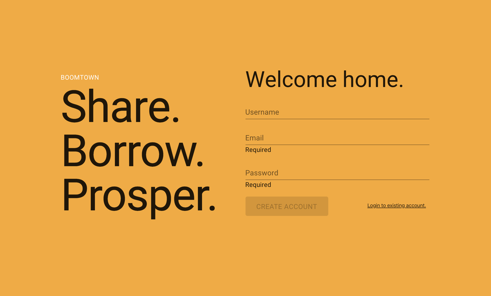
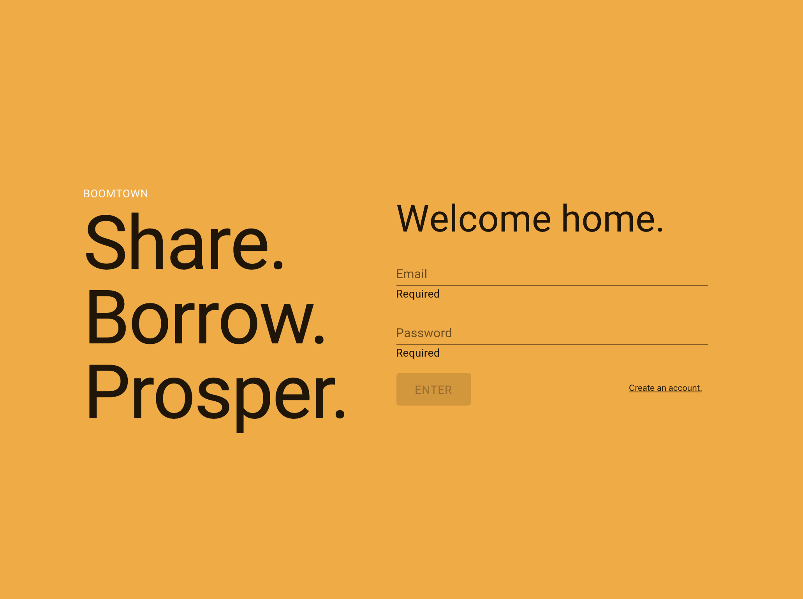
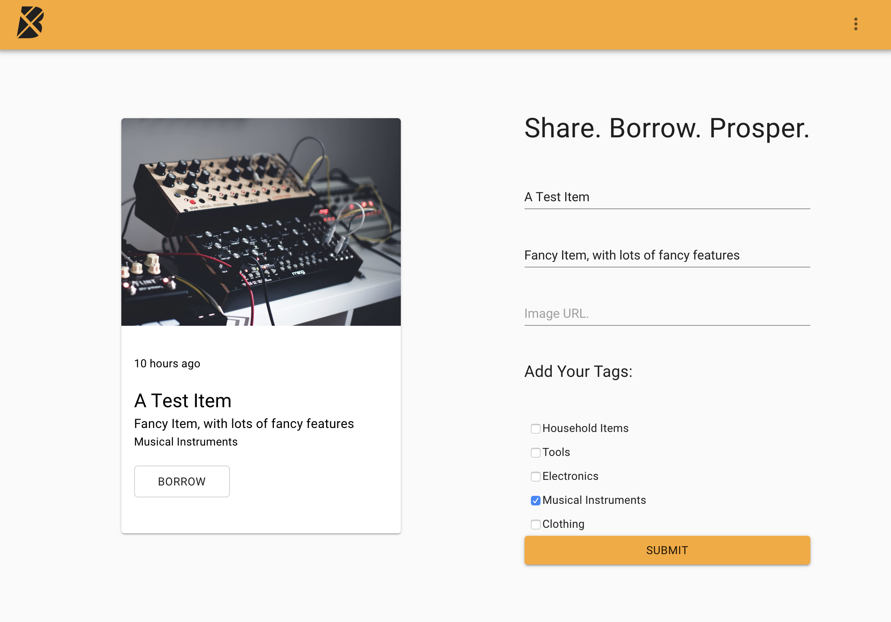
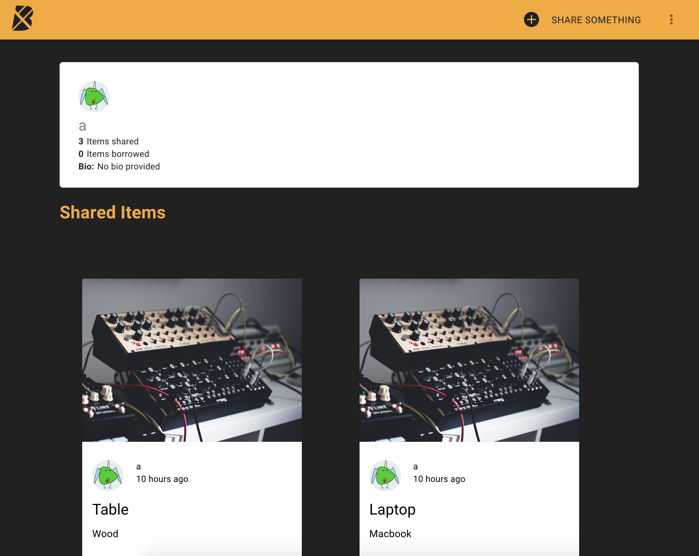
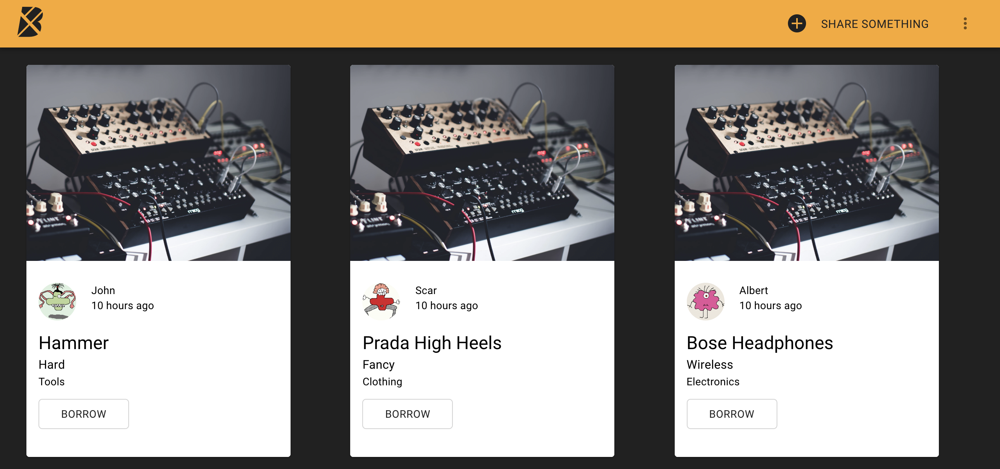
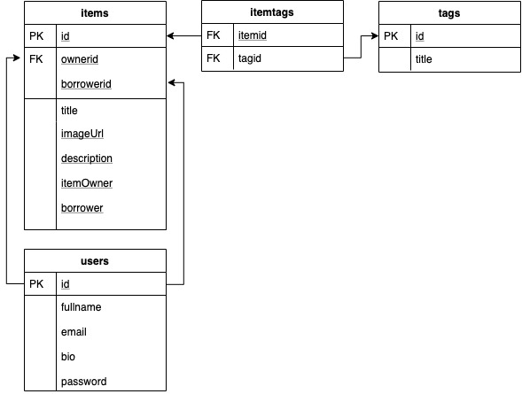
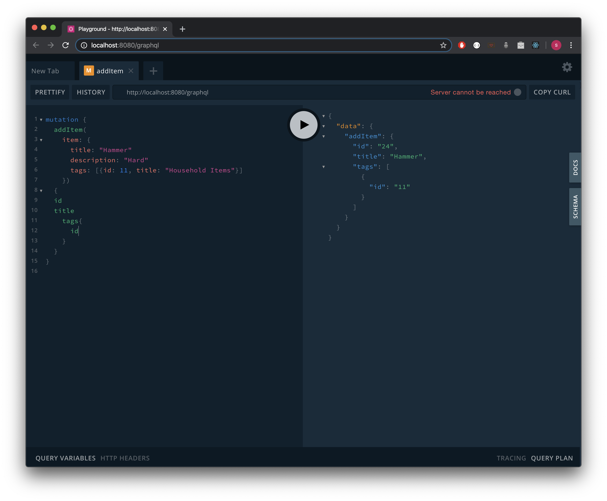

# Boomtown 🏙

My first project for the app dev program at RED Academy using JavaScript, PostgreSQL, Node.js, GraphQL, Apollo Servers.

### Technologies Used:

JavaScript, [PostgreSQL](https://www.postgresql.org/), [Node.js](https://nodejs.org/en/), [GraphQL](https://graphql.org/), [Apollo Server](https://www.apollographql.com/docs/apollo-server/), [Express](https://expressjs.com/)

### Installation

```bash
npm install -y
```

### Run

Server

```bash
npm run start:dev
```

Client

```bash
yarn start
```







## Relational Data Modelling



## Personal Learnings

- Create a database model using draw.io
- Build the database schema using PostgreSQL and perform CRUD operations on it
- Test and write queries in Javascript to retrieve data from our psql database
- Build an API with GraphQL and Apollo Server to serve the requested data to the client applications
- Importing and exporting files through JavaScript
- Use React's Context API for state management
- Use propTypes to document all component props
- Use Apollo Client's Query and Mutation components to manage data
- Refetch relevant GraphQL queries upon successful data mutation to keep the UI in sync

## GraphQL Mutation

GraphQL Mutation is a method to modify server-side data, mutation field returns an object type, and you can ask for nested fields



---

## Author

Sina Lankarani
https://github.com/carbonmass
